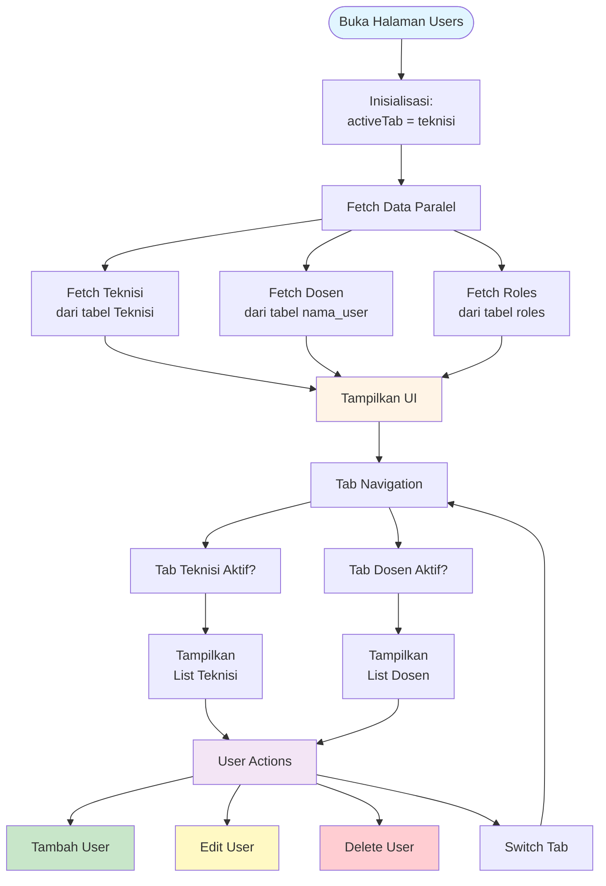
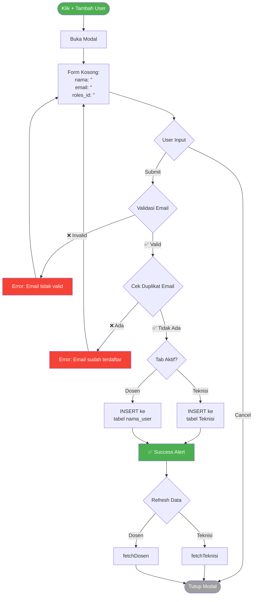
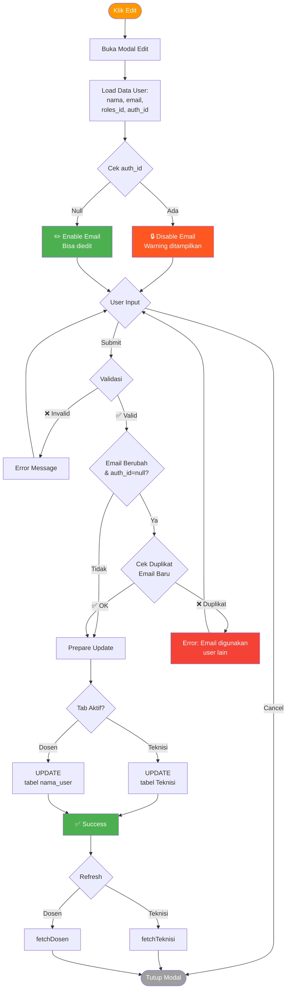
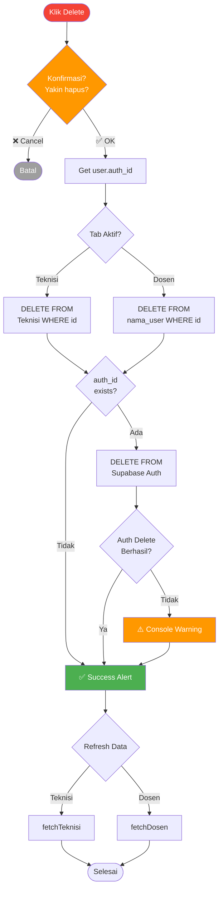
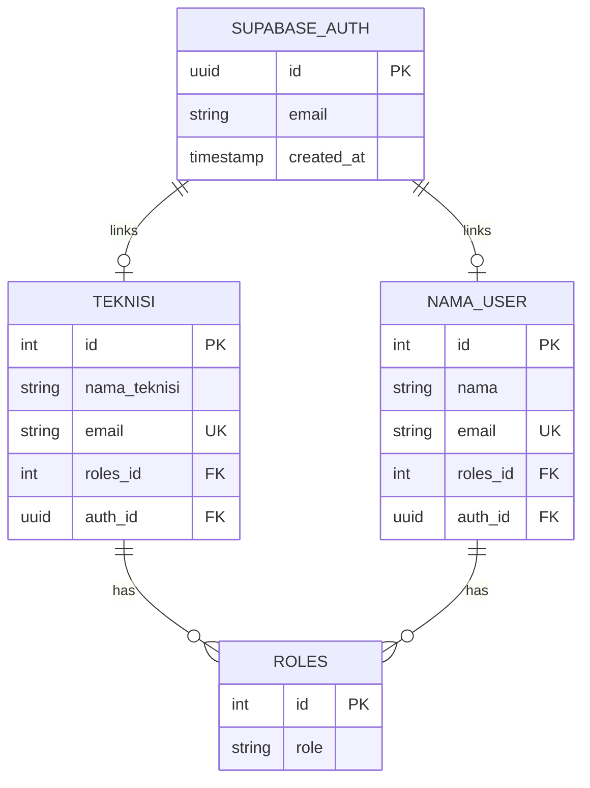
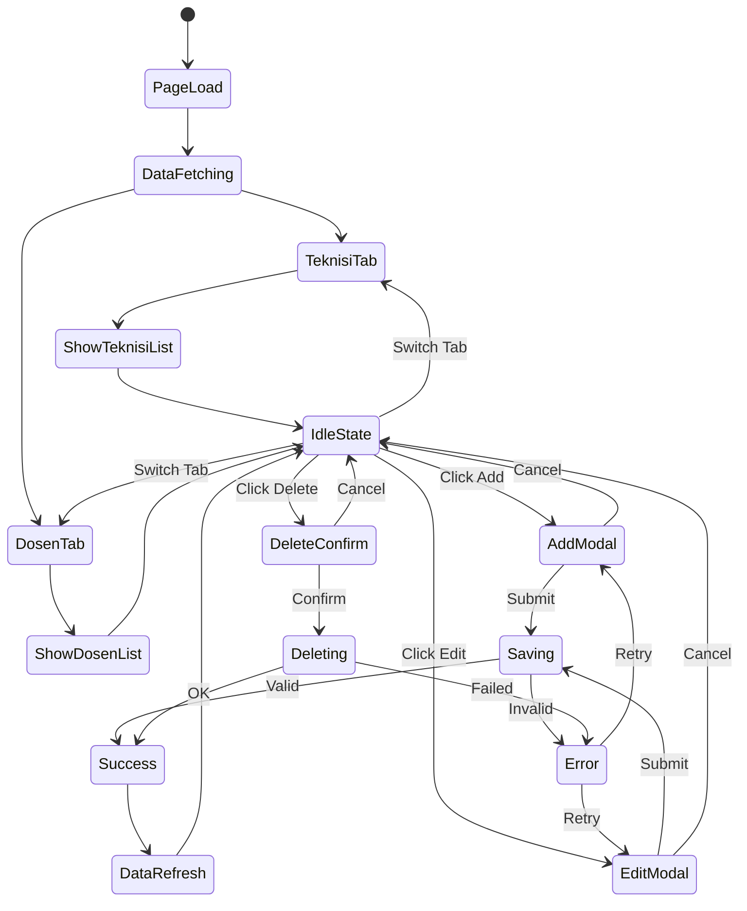
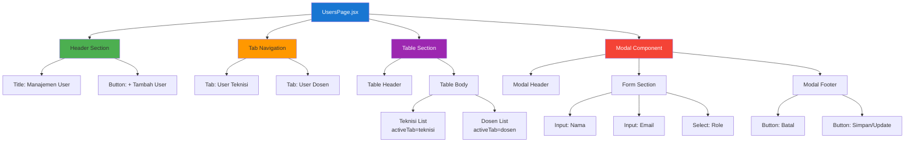
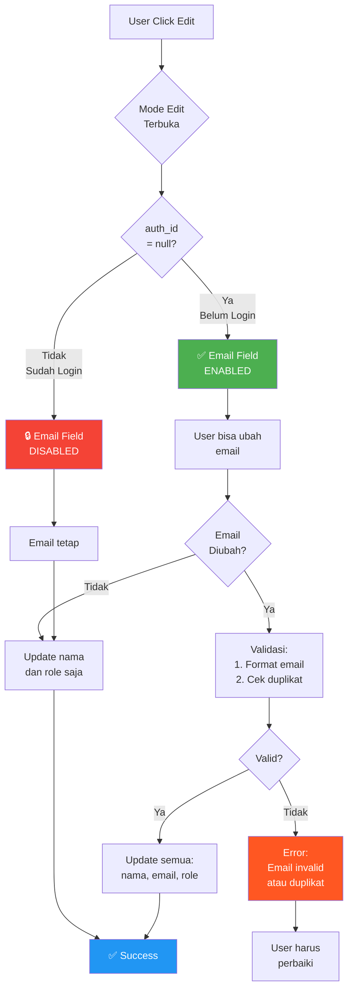

# Flowchart Visual - Sistem Manajemen User

## 1. Alur Utama Aplikasi



## 2. Alur Tambah User (Create)



## 3. Alur Edit User (Update)



## 4. Alur Delete User



## 5. Struktur Data dan Relasi



## 6. State Management Flow



## 7. Component Structure



## 8. Decision Tree - Email Edit Logic



## Catatan Implementasi

### State Variables

```javascript
// Tab Management
activeTab: 'teknisi' | 'dosen'

// Data Lists
teknisiList: Array<User>
dosenList: Array<User>
roles: Array<Role>

// Modal State
modalOpen: boolean
modalMode: 'add' | 'edit'
editId: number | null

// Form State
form: {
  nama: string,
  email: string,
  roles_id: string,
  auth_id: string | null
}

// UI State
loading: boolean
saving: boolean
error: string | null
```

### Database Tables

- **Teknisi**: `nama_teknisi`, `email`, `roles_id`, `auth_id`
- **nama_user**: `nama`, `email`, `roles_id`, `auth_id`
- **roles**: `id`, `role`

### Key Features

1. ✅ Tab switching (Teknisi ↔ Dosen)
2. ✅ CRUD operations per tab
3. ✅ Email validation
4. ✅ Duplicate check
5. ✅ Auth protection (email lock after login)
6. ✅ OTP login support
7. ✅ Cascade delete (DB + Auth)
