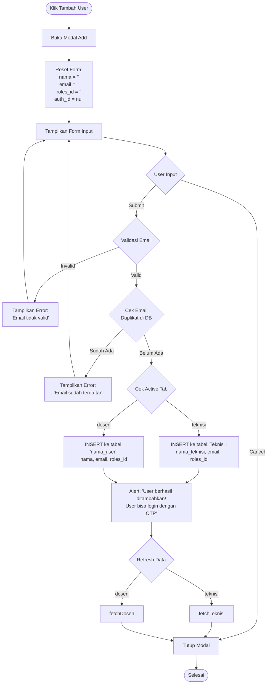
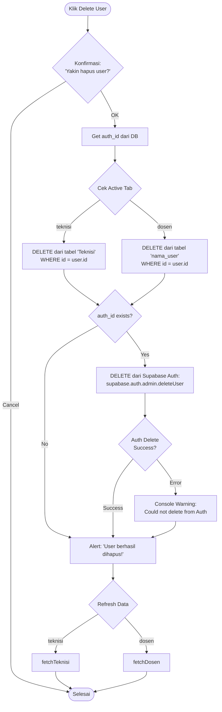

# Flowchart Manajemen User - Teknisi dan Dosen

## Overview

Sistem manajemen user dengan 2 tab terpisah untuk Teknisi dan Dosen dengan fungsi lengkap CRUD (Create, Read, Update, Delete).

## Flowchart Utama

```mermaid
flowchart TD
    Start([User Membuka Halaman Users]) --> LoadPage[Load UsersPage.jsx]
    LoadPage --> InitState[Inisialisasi State:<br/>- activeTab = 'teknisi'<br/>- teknisiList = []<br/>- dosenList = []<br/>- roles = []]
    InitState --> FetchData[Fetch Data Paralel:<br/>1. fetchTeknisi<br/>2. fetchDosen<br/>3. fetchRoles]

    FetchData --> DisplayTab{Pilih Tab}

    DisplayTab -->|Tab Teknisi| ShowTeknisi[Tampilkan Data Teknisi<br/>dari tabel 'Teknisi'<br/>field: nama_teknisi]
    DisplayTab -->|Tab Dosen| ShowDosen[Tampilkan Data Dosen<br/>dari tabel 'nama_user'<br/>field: nama]

    ShowTeknisi --> UserAction{Pilih Aksi}
    ShowDosen --> UserAction

    UserAction -->|Klik Tambah User| AddFlow[Alur Tambah User]
    UserAction -->|Klik Edit| EditFlow[Alur Edit User]
    UserAction -->|Klik Delete| DeleteFlow[Alur Delete User]
    UserAction -->|Switch Tab| DisplayTab

    AddFlow --> End([Selesai])
    EditFlow --> End
    DeleteFlow --> End
```

## Flowchart Detail: Tambah User



## Flowchart Detail: Edit User

```mermaid
flowchart TD
    EditStart([Klik Edit User]) --> OpenEditModal[Buka Modal Edit]
    OpenEditModal --> LoadData[Load Data User ke Form:<br/>- nama (teknisi/dosen)<br/>- email<br/>- roles_id<br/>- auth_id]
    LoadData --> ShowForm[Tampilkan Form Edit]

    ShowForm --> CheckAuthID{User sudah<br/>punya auth_id?}
    CheckAuthID -->|Yes| DisableEmail[Disable Email Field<br/>Tampilkan warning:<br/>'Email tidak dapat diubah']
    CheckAuthID -->|No| EnableEmail[Enable Email Field]

    DisableEmail --> UserInput{User Input}
    EnableEmail --> UserInput

    UserInput -->|Cancel| CloseModal[Tutup Modal]
    UserInput -->|Submit| ValidateInput{Validasi}

    ValidateInput -->|Invalid| ShowError[Tampilkan Error]
    ShowError --> ShowForm

    ValidateInput -->|Valid| CheckEmailChange{auth_id = null<br/>dan email berubah?}

    CheckEmailChange -->|Yes| CheckDuplicate{Cek Email Duplikat<br/>di DB (exclude user ini)}
    CheckEmailChange -->|No| PrepareUpdate[Prepare Update Data]

    CheckDuplicate -->|Duplikat| ShowError2[Error: 'Email sudah<br/>digunakan user lain']
    ShowError2 --> ShowForm

    CheckDuplicate -->|OK| PrepareUpdate

    PrepareUpdate --> DetermineTable{Cek Active Tab}

    DetermineTable -->|teknisi| UpdateTeknisi[UPDATE tabel 'Teknisi':<br/>nama_teknisi, roles_id<br/>+ email jika auth_id=null]
    DetermineTable -->|dosen| UpdateDosen[UPDATE tabel 'nama_user':<br/>nama, roles_id<br/>+ email jika auth_id=null]

    UpdateTeknisi --> ShowSuccess[Alert: 'User berhasil diupdate!']
    UpdateDosen --> ShowSuccess

    ShowSuccess --> RefreshData{Refresh Data}
    RefreshData -->|teknisi| RefreshTeknisi[fetchTeknisi]
    RefreshData -->|dosen| RefreshDosen[fetchDosen]

    RefreshTeknisi --> CloseModal
    RefreshDosen --> CloseModal
    CloseModal --> End([Selesai])
```

## Flowchart Detail: Delete User



## Struktur Database

### Tabel: Teknisi

```sql
- id (primary key)
- nama_teknisi (string)
- email (string, unique)
- roles_id (foreign key -> roles.id)
- auth_id (uuid, nullable, link ke Supabase Auth)
```

### Tabel: nama_user (untuk Dosen)

```sql
- id (primary key)
- nama (string)
- email (string, unique)
- roles_id (foreign key -> roles.id)
- auth_id (uuid, nullable, link ke Supabase Auth)
```

### Tabel: roles

```sql
- id (primary key)
- role (string, e.g., 'admin', 'dosen', 'user', 'super admin')
```

## Fitur Utama

### 1. Tab Navigation

- **Tab Teknisi**: Menampilkan user teknisi dari tabel `Teknisi`
- **Tab Dosen**: Menampilkan user dosen dari tabel `nama_user`
- Tab aktif ditandai dengan border biru di bawah
- Switch tab tidak me-reset modal atau form

### 2. Fungsi CRUD

- **Create**: Tambah user baru dengan validasi email dan cek duplikat
- **Read**: Tampilkan list user dengan role, email, auth ID
- **Update**: Edit nama, email (jika belum login), dan role
- **Delete**: Hapus user dari database dan Supabase Auth

### 3. Validasi

- Email harus valid (mengandung @)
- Email tidak boleh duplikat dalam 1 tabel
- Email tidak bisa diubah jika user sudah login (auth_id ada)

### 4. Authentication

- User bisa login menggunakan OTP (tidak perlu password)
- auth_id dibuat otomatis saat first login
- auth_id menandakan user sudah terdaftar di Supabase Auth

## UI Components

### Header

- Judul dinamis: "Manajemen User Teknisi" atau "Manajemen User Dosen"
- Button "+ Tambah User" (biru)

### Tabs

- 2 tab: "User Teknisi" dan "User Dosen"
- Active tab: border biru, text biru
- Inactive tab: border transparent, text abu-abu

### Table Columns

1. ID
2. Nama (nama_teknisi atau nama)
3. Email
4. Role (badge biru)
5. Auth ID (font monospace kecil)
6. Aksi (Edit biru, Delete merah)

### Modal

- Judul: "Tambah User Baru" atau "Edit User"
- Form fields:
  - Nama (required)
  - Email (required, disabled jika auth_id ada)
  - Role (dropdown dari tabel roles)
- Buttons: Batal (outline), Simpan/Update (biru)
- Error message (merah) jika ada kesalahan

## State Management

```javascript
// Tab state
activeTab: 'teknisi' | 'dosen';

// Data lists
teknisiList: [];
dosenList: [];
roles: [];
loading: boolean;

// Modal state
modalOpen: boolean;
modalMode: 'add' | 'edit';
form: {
  (nama, email, roles_id, auth_id);
}
editId: number | null;
saving: boolean;
error: string | null;
```

## Catatan Penting

1. **Tabel berbeda untuk Teknisi dan Dosen**:
   - Teknisi → tabel `Teknisi` dengan field `nama_teknisi`
   - Dosen → tabel `nama_user` dengan field `nama`

2. **Email Protection**: Email hanya bisa diubah sebelum user login pertama kali

3. **Delete Cascade**: Saat delete user, hapus juga dari Supabase Auth jika ada

4. **OTP Login**: User tidak perlu set password, login via OTP ke email

5. **Role Management**: Role diambil dari tabel `roles` yang sama untuk semua user
