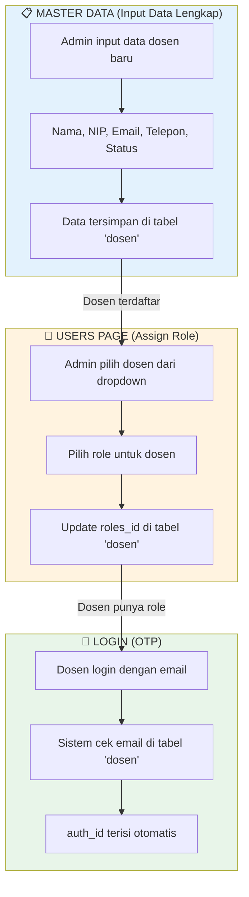
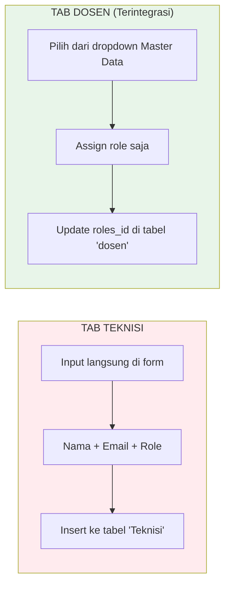
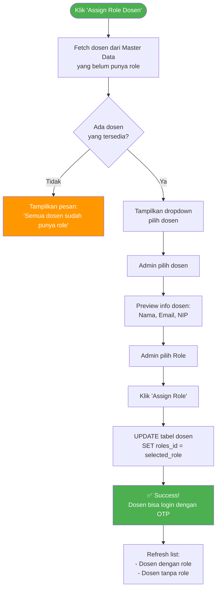
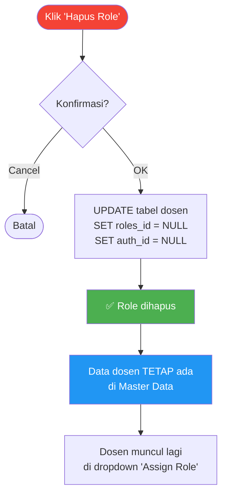
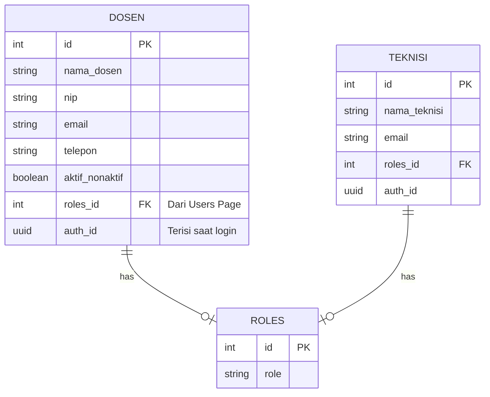

# Flowchart Manajemen User - Terintegrasi dengan Master Data

## 🎯 Konsep Utama: Single Source of Truth

**Master Data Dosen** = sumber utama data dosen (nama, NIP, email, telepon, status)
**Users Page** = tempat untuk **assign ROLE** ke user

### Keuntungan:

- ✅ Tidak perlu input data 2 kali
- ✅ Data konsisten dan terpusat
- ✅ Perubahan data dosen cukup di 1 tempat (Master Data)
- ✅ Role management terpisah dan jelas

---

## Flowchart: Alur Kerja Sistem



---

## Flowchart: Tab User Teknisi vs Tab User Dosen



---

## Detail: Alur Assign Role Dosen



---

## Detail: Alur Hapus Role Dosen



---

## Struktur Database Terintegrasi



---

## Perbedaan Tab Teknisi vs Dosen

| Aspek              | Tab Teknisi                 | Tab Dosen                         |
| ------------------ | --------------------------- | --------------------------------- |
| **Input Data**     | Langsung di form            | Pilih dari Master Data            |
| **Tabel Database** | `Teknisi` (terpisah)        | `dosen` (sama dengan Master Data) |
| **Tambah User**    | Input: Nama, Email, Role    | Pilih: Dosen, Role                |
| **Edit**           | Bisa ubah nama, email, role | Hanya bisa ubah role              |
| **Hapus**          | Delete permanen dari tabel  | Hanya hapus role (data tetap)     |
| **Data Lengkap**   | Di halaman Users            | Di Master Data                    |

---

## Kolom Tabel di UI

### Tab Teknisi:

| ID | Nama | Email | Role | Status Login | Aksi |

### Tab Dosen:

| ID | Nama | NIP | Email | Telepon | Role | Status Login | Aksi |

---

## Migration SQL

Untuk mengintegrasikan, jalankan SQL migration:

```sql
-- Tambah kolom roles_id ke tabel dosen
ALTER TABLE dosen
ADD COLUMN IF NOT EXISTS roles_id bigint REFERENCES roles(id);

-- Tambah kolom auth_id ke tabel dosen
ALTER TABLE dosen
ADD COLUMN IF NOT EXISTS auth_id uuid;
```

File: `MIGRATION_DOSEN_ROLES.sql`

---

## Catatan Penting

1. **Data dosen HANYA diinput di Master Data**
   - Nama, NIP, Email, Telepon, Status
2. **Role diassign di Users Page**
   - Pilih dosen → Pilih role → Assign
3. **Hapus role ≠ Hapus data**
   - Data dosen tetap tersimpan di Master Data
   - Dosen akan muncul lagi di dropdown untuk di-assign ulang

4. **Login dengan OTP**
   - Dosen login menggunakan email yang terdaftar di Master Data
   - auth_id terisi otomatis saat first login

5. **Filtering di dropdown**
   - Hanya dosen yang AKTIF dan BELUM punya role yang muncul
   - Dosen yang sudah punya role tidak muncul di dropdown
